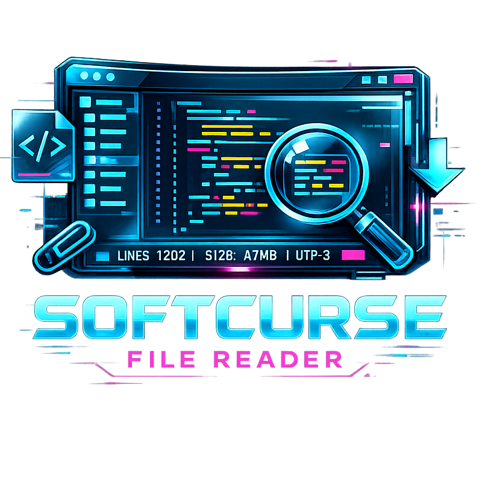

# 


> *BUILD THE FUTURE OR GET PROCESSED BY IT.*

## Table of Contents
- [Overview](#overview)
- [✨ Features](#-features)
- [📦 Installation](#-installation)
- [🚀 Quick Start](#-quick-start)
- [🏗️ Architecture](#️-architecture)
- [🧪 Testing & Building](#-testing--building)
- [🤝 Contributing](#-contributing)
- [🛣️ Roadmap](#️-roadmap)
- [📄 License](#-license)
- [💬 Support](#-support)

## Overview
**SOFTCURSE File Reader** is a lightning-fast, universal text file viewer wrapped in an unapologetic, cyberpunk retro-futuristic interface. Built to handle everything from raw source code and Markdown to legacy `.nfo` files and ANSI logs, it sidesteps bloated editor features to give you pure, uncompromising data visualization. 

Whether you're deeply entrenched in software development, parsing server logs, or just appreciate glassmorphism and geometric UI design, this tool provides a visually stunning way to inspect your files.

## ✨ Features
- **Universal Format Support:** Reads over 100+ text extensions natively.
- **Deep Syntax Highlighting:** Out-of-the-box support for Python, JavaScript/TS, C/C++, HTML/CSS, SQL, Shell, Java, Rust, Go, Ruby, and many more.
- **Legacy Terminal & NFO Support:** Built-in `CP437` decoding and a custom inline ANSI escape sequence parser for viewing colorful BBS art, `.nfo` files, and terminal logs without formatting corruption.
- **Immersive Aesthetic:** A void-black UI with strict cyan accents, grid backgrounds, noise overlays, and a custom animated "Cyber S" SVG cursor.
- **Streamlined UX:** Multi-tab interface, drag & drop support, live regex-ready search, and line-number toggling.
- **Safety First:** Automatic 50 MB file size protection prevents memory overflow from massive dumps.

## 📦 Installation

### Binary Download (Windows 10/11)
The fastest way to get started is to use the standalone installer. 
1. Download `SoftcurseFileReader_Setup_v1.0.0.exe` from the latest [Releases](#).
2. Run the installer to unpack the app and automatically create file associations for `.txt`, `.md`, `.json`, etc.
3. Launch **SOFTCURSE File Reader** from your Start menu or desktop shortcut.

### From Source (Developers)
If you prefer to run or build the application from source:

**Prerequisites:** 
- Python 3.12+ (tested on Windows 10/11)
- Windows Python Launcher (`py`)

```bash
# Clone the repository
git clone https://github.com/softcurse/softcurse-reader.git
cd softcurse-reader

# Install Python dependencies
py -m pip install pywebview pyinstaller

# Run the app directly
py src/main.py
```

## 🚀 Quick Start
Once installed or running from source, you can open files via the UI, Drag & Drop, or through the CLI:

```bash
# Open a file directly via command line
SoftcurseFileReader.exe path/to/your/script.py
```

Inside the application, hit **OPEN FILE** on the top toolbar or drop any file onto the window. Use the **FIND** button (or Enter in search box) to quickly search through the loaded document.

## 🏗️ Architecture
SOFTCURSE File Reader uses a hybrid architecture for maximum performance and flexible UI styling:
- **Backend (Python 3):** Handles heavy lifting, file I/O operations, complex text decoding (UTF-8, CP437, UTF-16, Latin-1), and fast directory traversals. Uses `pywebview`.
- **Frontend (HTML/JS/Vanilla CSS):** A custom, frameless WebView2 window that renders the DOM. Syntax highlighting and UI state are entirely managed by lightweight Vanilla JS to avoid framework overhead. 

## 🧪 Testing & Building

### Compiling to Executable
We use PyInstaller to compile the Python backend and web assets into a portable `.exe`.

```bash
# Build the standalone executable
py -m PyInstaller softcurse_reader.spec --noconfirm
```

### Compiling the Installer
To generate the final setup executable, you will need [Inno Setup 6](https://jrsoftware.org/isdl.php).

```bash
# Compile the installer (creates installer_output/)
iscc installer.iss
```

## 🤝 Contributing
We invite cyber-runners, developers, and designers to contribute to the SOFTCURSE ecosystem. From adding new syntax highlighting rules to tweaking the custom cursor behavior, all PRs are welcome.

Please see our [CONTRIBUTING.md](.github/CONTRIBUTING.md) for branch naming conventions, PR gates, and environment setup guidelines.

## 🛣️ Roadmap
- [ ] Add hex-view mode for inspecting binary files safely.
- [ ] Support for custom aesthetic theme profiles (e.g., "Neon Magenta" or "Amber Terminal").
- [ ] Cross-platform compilation (macOS/Linux) via native WebKit integrations.

## 📄 License
This project is licensed under the [MIT License](LICENSE). You are free to modify, distribute, and use this software for both private and commercial purposes.

## 👥 Acknowledgements
- Powered by [pywebview](https://pywebview.flowrl.com/).
- UI Inspiration from classic BBS culture and modern glassmorphism trends.

## 💬 Support
- **Official Website:** [softcurse-website.pages.dev](https://softcurse-website.pages.dev/)
- **Email:** [softcursesystems@gmail.com](mailto:softcursesystems@gmail.com)
- **Bugs & Requests:** Open an issue on [GitHub Issues](https://github.com/softcurse/softcurse-reader/issues)
